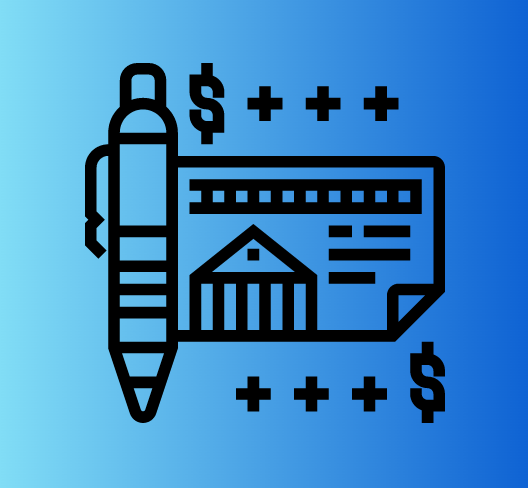

 

    
    <h3 align="center">Bank System</h3>
  

     
      <h5 align="center">Developed by:</h5>
        

          <a href="https://github.com/israelld">
            
             
          
          <b>Israel Dias</b>
          
          </a>
        

       
  

## Índice

* [Overview](#overview) 
* [Functionalities](#functionalities)
* [Technologies and Tools](#technologies-and-tools)
* [How to Run](#how-to-run)
* [Contact me](#contact-me)

## Overview

The objective of this project is for the application to manage a bank account, allowing creation, consultation and removal operations to be carried out, in addition to withdrawal and deposit operations, and this account must also have a credit card.

And speaking of Automated Tests, unit tests were performed in the project.

## Functionalities

The API uses the HTTP methods: GET, POST, PUT and DELETE, to register, list, update and delete customers. 

Also provide a breakdown of transaction history between accounts.

A Database with well-structured tables and populated with values for tests is used.

## Technologies and Tools: 

- Java
- JUnit
- Maven
- MySQL
- Mysql Driver
- MySQL Workbench
- PostgreSQL
- Postman / Insomnia
- Spring Boot
- Spring Data JPA
- Spring Web
- Swagger
- Swagger UI

## How to Run:

You need to have:
- Java 11+;
- MySQL (and );
- Download the project here from GitHub;
- Open in your Java IDE;
- Configure mysql database username and password in application.properties.
- Postman to test endpoints

## Contact me!

Feel free to send me a message.

<address>
   
  <- Send me a mail
  

  
  <- Let's connect   
 
</address>
 

 : ) 

